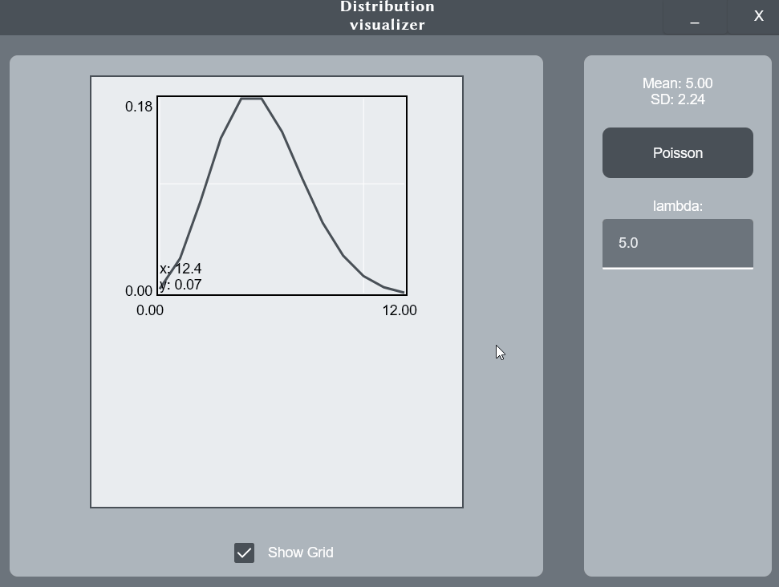

# Distribution Visualizer 1.1b

 

Application visualizing common probability distributions based on probability density function.
The technology used illustrates the potential of combining the building of a user interface with the calculation of mathematical models by the engine.



# Technologies

- Desktop Compose 1.2.2
- Kotlin 1.7.20

# Requirements

- JDK 11
- Gradle 8.0.2

# Application execution

1. Make sure your JAVA_HOME paths to jdk directory.
2. Clone repository:
```
git clone https://github.com/ExaggeratedRumors/distribution-visualizer.git
```
3. Open application root directory and put command:
```
./gradlew run
```